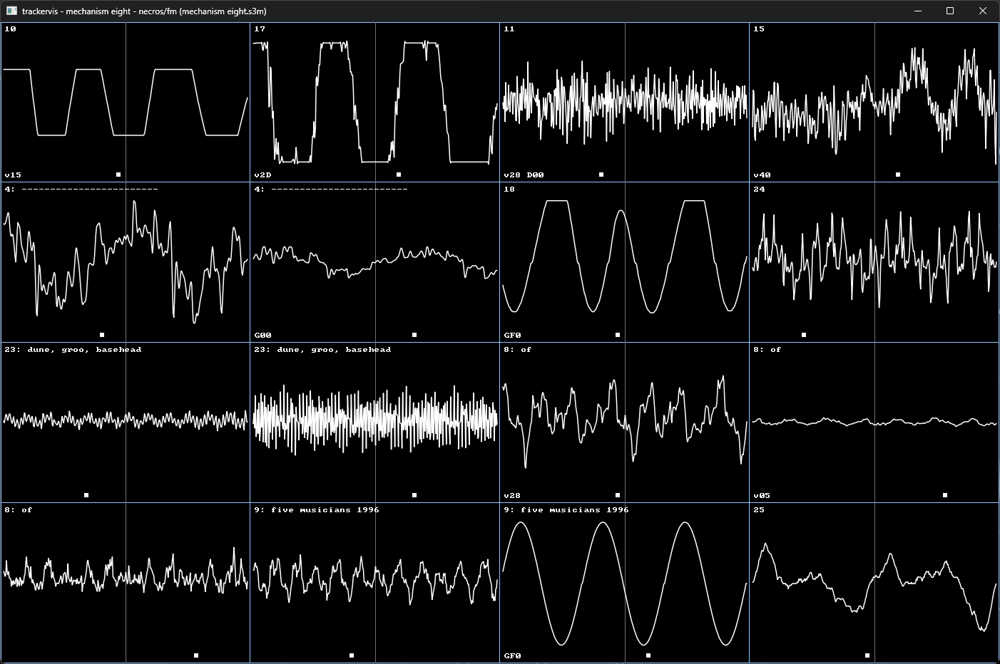

# Trackervis (wip)

Tracker module oscilloscope visualizer and renderer, (ought to be) used for some vids on my youtube channel.

Uses [libopenmpt](https://openmpt.org/) for audio rendering, [cpal](https://github.com/RustAudio/cpal) for audio playback, [vello](https://github.com/linebender/vello) and wgpu for graphics rendering.

